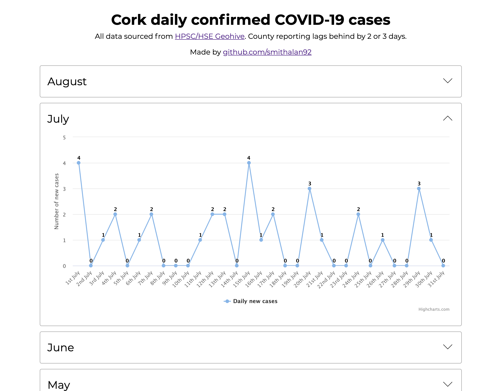

# Cork Daily Confirmed Covid Cases

A simple app to graph the amount of new COVID-19 cases in Cork, Ireland each day using data sourced from the [HPSC/HSE Geohive](https://covid19ireland-geohive.hub.arcgis.com/).

View - [covid-cork.mralansmith.com/](http://covid-cork.mralansmith.com/)

Note: Cases by county data lags behind a few days from the total confirmed from the country.

Built using [Vue.JS](https://vuejs.org/), Charts by [Highcharts](https://www.highcharts.com/). Down Arrow from [Flaticon.com](https://www.flaticon.com/)